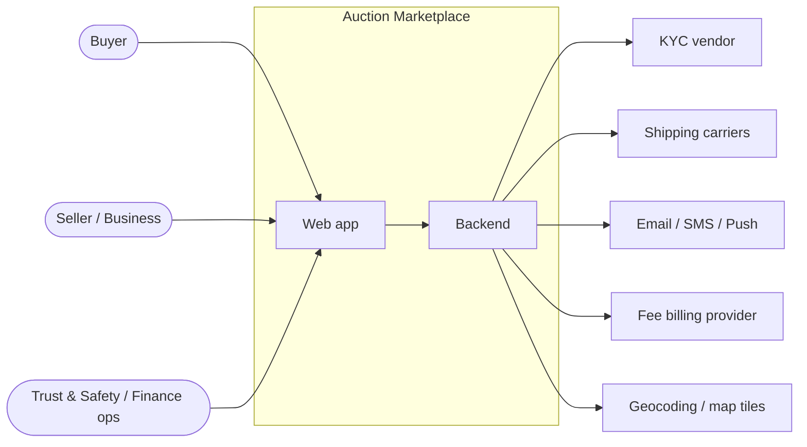
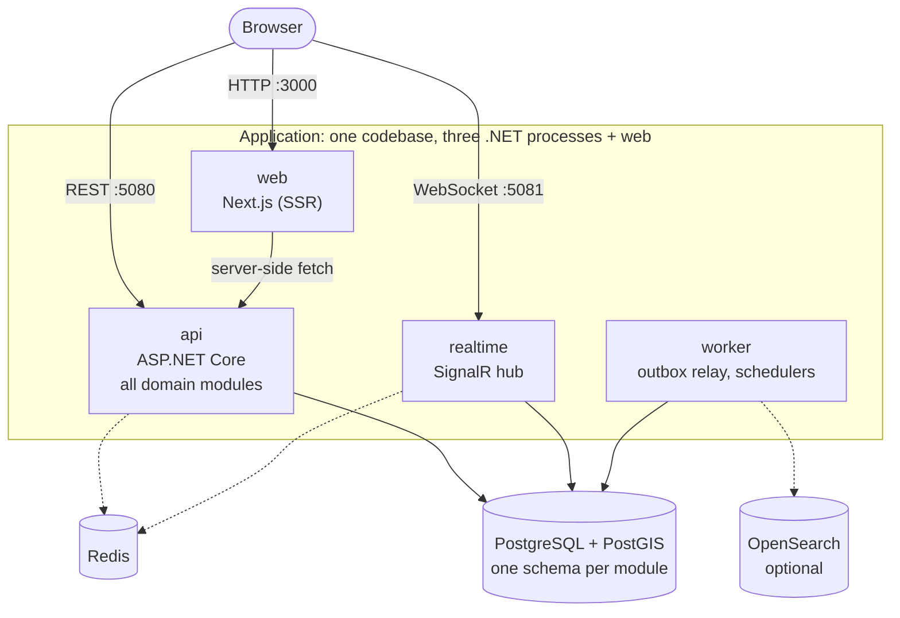
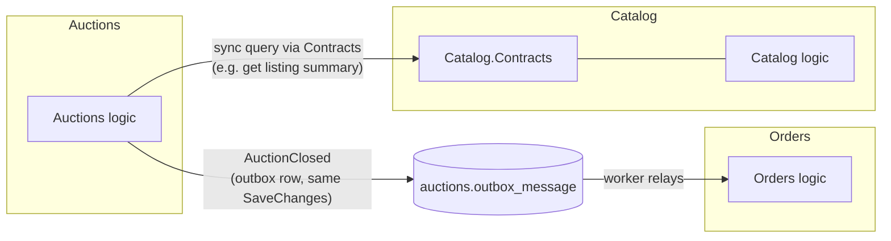
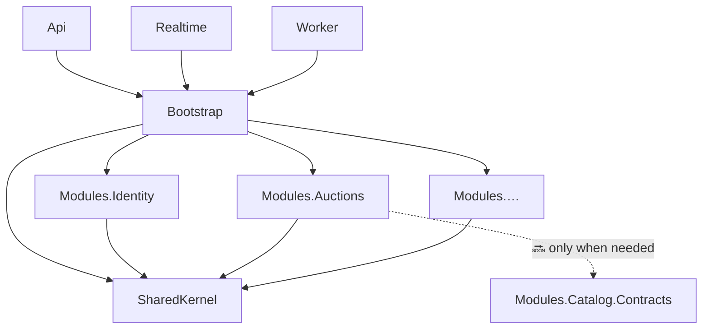

# Online Auction Marketplace: Architecture, Design and Project Structure

| | |
|---|---|
| Status | v0.2 (2026-10-09): MVP core loop implemented |
| Related | [03 System design](03-system-design.md) (ADR, bidding engine, data model, API) · [04 Project setup](04-project-setup.md) (how the repo was built) · [Claude skill](../.claude/skills/auction-marketplace/SKILL.md) |

This document explains **how the system is shaped and why**:
1. The architecture: processes, modules and how they talk.
2. The design rules inside the code.
3. The project structure: what each folder is for and where new code goes.
4. The principles behind each choice.

The domain details (proxy-bid maths, state machines, tables, endpoints) are in [03 System design](03-system-design.md). This document doesn't repeat them.

Each item is marked as one of:
- **✅ Now**: in the repo and verified.
- **🔜 Planned**: decided, but there's no code yet.
- **⏳ Later**: only when a measured need appears.

---

## 1. Architecture at a glance

### 1.1 System context

Who and what the platform talks to.



There's **no payment processor for sales**. Buyers pay sellers outside the app, and the platform records the deal agreement and both confirmations (feature design §6).

### 1.2 Containers: what actually runs ✅ Now



| Process | Responsibility | Scales by | Status |
|---|---|---|---|
| `web` | Pages and SSR, plus a backend-for-frontend proxy (`/api/proxy/*`) that adds the user's token | Requests | ✅ MVP pages |
| `api` | REST API for every module, **owns migrations** | CPU / request rate | ✅ |
| `realtime` | Pushes live price, bid and end-time updates to watchers, and personal events to `user:{id}` | Concurrent connections | ✅ |
| `worker` | Outbox relay (event handlers + realtime pushes) and background jobs (`auctions.close` every second) | Queue depth | ✅ |
| PostgreSQL + PostGIS | System of record, geo queries, the Search read model | Vertical, then read replicas | ✅ |
| Redis | Pub/sub channel from the worker to realtime; later bid rate limits | | ✅ pub/sub |
| OpenSearch | Full-text + geo search index (a copy of Postgres) | | ⏳ PostGIS first |

All four app containers come from **two images**:
- The root `Dockerfile` builds the three .NET processes. The `PROJECT` build argument picks which one.
- `web/Dockerfile` builds the Next.js app.

### 1.3 Architectural style: modular monolith

**One codebase, one database, deployed as several processes.** Inside, the code is split into modules with hard boundaries, as if they were services, but they run in one process and share one transaction where they need to.

Why not microservices (full ADR in [system design §2](03-system-design.md#2-architecture-decision-modular-monolith-not-microservices)):
- **Bidding needs strong consistency per auction.** In one process that's one transaction. Across services it would need sagas or distributed locks.
- **The MVP is small and the team is small.** Microservices add deployments, networking, tracing and versioned APIs before there's a problem for them to solve.
- **The scale target fits:** 500 bids/s and 100k viewers fit one well-built application plus a WebSocket tier.

How a service gets **extracted later**: the module boundaries are already service boundaries. Its schema becomes its database, its Contracts become an HTTP/gRPC client, and its outbox events go to a broker. The order is realtime → notifications → search → bidding, and only when a measured signal calls for it.

---

## 2. Design

### 2.1 Modules (bounded contexts)

Each module is one **bounded context**: it has its own language, its own data and its own rules.

| Module | Owns (schema) | Main concepts | Publishes | Reacts to | Status |
|---|---|---|---|---|---|
| Identity | `identity` | User (dev sign-in now); trust tier, Org, role, approval limit later | | | ✅ users, 🔜 orgs/KYC |
| Location | `location` | Place (gazetteer), item location: exact `geo` + address (private), fuzzed `public_geo`; user location | (sync API `ILocationService`) | | ✅ |
| Catalog | `catalog` | Category, Listing, delivery option, public location snapshot | `catalog.listing_published.v1` (+ sync `IListingQueries`) | `AuctionClosed` | ✅ |
| Auctions | `auctions` | Auction, Bid, proxy max, increment, soft close, Buy Now, idempotent bid requests | `auctions.auction_started.v1`, `auctions.bid_placed.v1`, `auctions.auction_closed.v1` | `ListingPublished` | ✅ |
| Orders | `orders` | Order, DealAgreement (versioned), DealEvent (append-only) | `orders.order_updated.v1` | `AuctionClosed` | ✅ |
| Search | `search` | `listing_card` read model (listing + live auction state, public geo) | | `ListingPublished`, `AuctionStarted`, `BidPlaced`, `AuctionClosed` | ✅ |
| Billing | `billing` | Fee rule, fee line, monthly FeeInvoice | `InvoiceIssued` | `DealPaid` | 🔜 |
| Reviews | `reviews` | Review, ProblemReport | `ProblemReported` | `OrderReceived` | 🔜 |
| Messaging | `messaging` | Conversation, message | `MessageSent` | | 🔜 |
| Notifications | `notifications` | Templates, channels, preferences, delivery log | | most events | 🔜 (realtime toasts only) |
| Admin | `admin` | Moderation case, admin action log | | `ProblemReported` | 🔜 |

Event wire names are versioned (`module.event_name.vN`), and an architecture test checks the format and uniqueness.

### 2.2 How modules talk



There are two allowed channels and nothing else:

| Need | Channel | Rule |
|---|---|---|
| **Ask** another module something now, as a read or a validation | **Synchronous**, through `Marketplace.Modules.X.Contracts` (interfaces + DTOs) | No reaching into the other module's tables or internal classes |
| **Tell** others that something happened | **Asynchronous**, through an outbox event | The event is written in the **same transaction** as the state change. The worker delivers it at least once, so handlers must be idempotent. |

This gives **strong consistency inside a module** (one transaction) and **eventual consistency between modules** (outbox). For example, when an auction closes, the order and deal agreement appear a moment later, never half-created.

### 2.2a Runtime mechanics ✅ Now

```mermaid
sequenceDiagram
  participant B as Browser
  participant W as web (BFF)
  participant A as api
  participant DB as Postgres
  participant K as worker
  participant R as Redis
  participant RT as realtime
  B->>W: POST /api/proxy/v1/auctions/{id}/bids
  W->>A: + Bearer token, Idempotency-Key
  A->>DB: BEGIN; SELECT … FOR UPDATE; bid rows + auctions.outbox_message; COMMIT
  K->>DB: claim pending outbox rows (FOR UPDATE SKIP LOCKED)
  K->>K: run handlers (Search card update, …), each with its inbox row
  K->>R: publish realtime push (bid.placed, user.outbid)
  R->>RT: subscriber
  RT-->>B: SignalR group auction:{id} / user:{id}
```

- **Integration events:** records in `*.Contracts`, tagged `[IntegrationEvent("module.event.vN")]`, published with `db.Publish(evt, clock.UtcNow)` (outbox row, same `SaveChanges`). Events that implement `IRealtimeEvent` also list their browser pushes, with public data only.
- **Handlers:** `IntegrationEventHandler<TEvent, TContext>` runs the work, any follow-up events and an **inbox** row (`<schema>.inbox_message`) in one transaction. Delivery is at least once, and the effect happens exactly once. A failing handler is retried on the next relay pass, up to 10 attempts.
- **Relay:** `OutboxProcessor` (SharedKernel) runs in the worker about every 250 ms. Tests call `DrainAsync()` directly.
- **Background jobs:** `IBackgroundJob` (e.g. `auctions.close`) is registered by modules and run only by the worker's `JobRunner`. Jobs are idempotent and claim work with `SKIP LOCKED`.
- **Auth (dev):**
  - JWT bearer. `POST /v1/dev/token` issues tokens when `Auth:DevTokens` is true. Modules only see `ICurrentUser`.
  - The web keeps the token in an httpOnly cookie and calls the api through its BFF proxy. SignalR gets the token from `/api/session`.
  - A real identity provider replaces only the configuration.
- **Errors:** modules throw `ProblemException` with a stable `code`. The api maps it to RFC 7807 problem details: 400, 403, 404 or 409.

### 2.3 Data design ✅ Now

- **One PostgreSQL database, one schema per module.** There is no shared schema. Each module's schema holds its own tables, its own `outbox_message` and its own `__ef_migrations_history`.
- **Code-first with EF Core 10:**
  - Every module has one `<Name>DbContext : ModuleDbContext` in `Persistence/`. The base class sets the default schema, adds the outbox, and applies every `IEntityTypeConfiguration` in the module's assembly.
  - Change the C# model, then run `dotnet ef migrations add <Name>` (the tool is pinned in `dotnet-tools.json`). Migrations are generated into `Persistence/Migrations/`.
  - A small design-time factory per module lets `dotnet ef` build the context without a host.
  - Conventions:
    - Npgsql provider; snake_case names via `EFCore.NamingConventions`.
    - NetTopologySuite for PostGIS (every context ensures the `postgis` extension).
    - `DateTimeOffset` maps to `timestamptz`.
  - `DatabaseMigrator` applies pending migrations for every module, in `ModuleCatalog` order, under a Postgres advisory lock. Only the `api` process runs it. A second start applies nothing.
  - Applied migrations are never edited; changes go in a new migration.
  - **Drift guard:** an architecture test fails if a module's model has changes without a migration (`HasPendingModelChanges`), and prints the `dotnet ef` command to run.
- **Geo:**
  - PostGIS `geography(Point, 4326)`.
  - Exact `geo` is private. Public reads use `public_geo`, fuzzed to about 1 km, plus a rounded distance.
- **Hot paths:** EF Core is the default. The bidding path takes the row lock with raw SQL through the same context (`AuctionsDbContext.LockAuctionAsync`: `FromSql($"SELECT … FOR UPDATE")`) inside an explicit transaction. Order changes take `SELECT 1 … FOR UPDATE` first, so both parties' actions serialise.
- **Read model:** Search keeps `search.listing_card` (GiST index on `public_geo`) for "Near you" and search, with `ST_DWithin` and distance sort through NetTopologySuite LINQ. OpenSearch can replace it later behind the same endpoints.
- **Outbox in the same unit of work:** a module adds an `OutboxMessage` to `context.OutboxMessages` next to its entity changes, and one `SaveChanges` commits both.

### 2.4 Consistency and correctness design ✅ Now (tested in unit, property and integration tests)

| Concern | Design |
|---|---|
| Concurrent bids | **Single writer per auction:** the bid transaction locks the auction row (`FOR UPDATE`). No lost or double-accepted bids. |
| Retries and double clicks | Every bid carries an `Idempotency-Key`, and a replay returns the first result. Outbox handlers are idempotent because delivery is at least once. |
| Fair timing | The server clock is the only time source (`IClock` ✅). Each bid gets a timestamp and a per-auction sequence number, and ties go to the earliest bid. |
| Auction end | Soft close: a bid in the last 2 minutes moves the end to now + 2 minutes. The close job is idempotent and re-checks `end_at`, and a sweeper catches missed closes. |
| Deal agreement | Versioned. Accept and confirm calls carry the version, and a stale version is rejected. `deal_event` is append-only. |

### 2.5 Security and privacy by design

- **No payment data at all**, so the riskiest data class simply doesn't exist in the system.
- **Location privacy:** fuzzed public point and rounded distance. The exact address is revealed only to the buyer, only after both parties accept the agreement. Buyer GPS needs consent and is never shown to sellers.
- **Secrets:** none are in the repo. Local values live in a git-ignored `.env` generated by `scripts/init-env.ps1`. Compose and the .NET hosts (`DotEnv.Load()`) read it. In production, real values come from environment variables or a secret store (12-factor), and environment variables always win over `.env`. Postgres and Redis both require passwords. ✅
- **Containers run as non-root** (`$APP_UID` for .NET, `node` for web). ✅
- 🔜 Planned: MFA for sellers and org admins, bid rate limiting (Redis), an audit log for every admin action.

### 2.6 Testing strategy, with architecture tests as fitness functions

| Layer | What | Status |
|---|---|---|
| Architecture tests | No module→module references; `*.Contracts` reference only SharedKernel; event names unique and versioned; SharedKernel references no module; unique lowercase module names. Per module: exactly one DbContext with its own schema; every table in that schema; has an outbox; migrations exist and **match the model** (drift guard) | ✅ 50 tests |
| API smoke tests | In-process host (`WebApplicationFactory`, environment `Testing`, no database): liveness and module list | ✅ 2 tests |
| Domain unit + property tests (`Marketplace.UnitTests`) | Proxy-bid rules and invariants (300 seeded random sequences), increment boundaries, soft close and its cap, Buy Now, close/reserve, deal agreement rules, grid snapping, distance rounding, handle masking | ✅ 350 tests |
| Integration tests (`Marketplace.IntegrationTests`, Testcontainers PostGIS) | Full loop through the API and relay; 50 parallel bids; idempotent retries; close job with soft close; realtime pushes; privacy scan of public responses; Near you / Ships to you / radius / nearest sort; Buy Now; unmet reserve; problem codes | ✅ 10 tests |
| Container check | `docker compose up -d --build`, seed script, browser walkthrough of the whole loop with two users | ✅ manual |

---

## 3. Project structure

### 3.1 Repository layout ✅ Now

```
OnlineAuctionMarketplace/
├─ src/
│  ├─ Marketplace.Api/              # process: REST API; runs migrations (Program.cs)
│  ├─ Marketplace.Realtime/         # process: SignalR hub /hubs/auctions + RedisRealtimeSubscriber
│  ├─ Marketplace.Worker/           # process: OutboxRelay + JobRunner (IBackgroundJob)
│  ├─ Marketplace.Bootstrap/        # composition root: ModuleCatalog.All, AddMarketplace(), event registry, Redis publisher
│  ├─ Marketplace.SharedKernel/     # shared core: IModule, IClock, ProblemException, health check
│  │  ├─ Persistence/               #   ModuleDbContext (+Publish), AddModuleDbContext, design-time factory, DatabaseMigrator
│  │  ├─ Outbox/                    #   OutboxMessage, InboxMessage, OutboxProcessor
│  │  ├─ Events/                    #   IIntegrationEvent, [IntegrationEvent], IntegrationEventHandler, IRealtimeEvent
│  │  ├─ Auth/                      #   AuthOptions, ICurrentUser, DevTokenIssuer, JWT setup
│  │  ├─ Geo/                       #   GeoPoints, PublicGrid (≈1 km snapping, distance rounding)
│  │  ├─ Jobs/                      #   IBackgroundJob
│  │  └─ Realtime/                  #   IRealtimePublisher
│  └─ Modules/                      # + Marketplace.Modules.{Location,Catalog,Auctions,Orders}.Contracts
│     ├─ Marketplace.Modules.Identity/
│     ├─ Marketplace.Modules.Location/
│     ├─ …  (Catalog, Auctions, Orders, Billing, Reviews, Messaging, Notifications, Search)
│     └─ Marketplace.Modules.Admin/
│        ├─ AdminModule.cs                 # the module's only public entry point (Schema = "admin")
│        └─ Persistence/
│           ├─ AdminDbContext.cs           # code-first model of the "admin" schema (internal)
│           ├─ AdminDbContextFactory.cs    # design-time factory for dotnet ef (internal)
│           └─ Migrations/                 # generated: <timestamp>_InitialCreate.cs + model snapshot
├─ tests/
│  ├─ Marketplace.ArchitectureTests/   # boundary rules (fitness functions)
│  ├─ Marketplace.Api.Tests/           # in-process API smoke tests
│  ├─ Marketplace.UnitTests/           # domain rules + property tests (Auctions, Orders, geo privacy)
│  └─ Marketplace.IntegrationTests/    # Testcontainers PostGIS: full loop, concurrency, privacy, geo
├─ web/                                # Next.js App Router: pages (/, /search, /item, /sell, /orders, /me, /signin),
│                                      #   BFF routes (/api/proxy, /api/session), lib/realtime.ts (SignalR), own Dockerfile
├─ scripts/seed-demo.ps1               # demo data through the public API
├─ docs/                               # specs 01–05
├─ mockup/                             # clickable vanilla-JS prototype
├─ .claude/skills/auction-marketplace/ # Claude Code skill: rules, workflows, new-module script
├─ Dockerfile  .dockerignore           # .NET image (build arg PROJECT)
├─ docker-compose.yml                  # full local stack
├─ Directory.Build.props               # shared MSBuild: net10.0, nullable, implicit usings
├─ Directory.Packages.props            # central package versions (EF Core, Npgsql, tests)
├─ dotnet-tools.json                   # pinned local tools: dotnet-ef
├─ global.json  Marketplace.slnx  .editorconfig  .gitignore  .gitattributes
└─ README.md
```

### 3.2 Dependency rules between projects ✅ Now (enforced)



| Project | May reference | Must not reference |
|---|---|---|
| Hosts (Api, Realtime, Worker) | Bootstrap | Module internals directly |
| Bootstrap | SharedKernel, every module | Hosts |
| A module | SharedKernel, other modules' `*.Contracts` | Other modules' implementation projects |
| `*.Contracts` ✅ (Location, Catalog, Auctions, Orders) | SharedKernel only | Its own module's implementation |
| SharedKernel | Framework + Npgsql | Any module, Bootstrap |

Bootstrap is the **composition root**. It's the only place that knows every module, so adding a module touches exactly one list (`ModuleCatalog.All`). The `new-module.ps1` script does that for you.

### 3.3 Inside a module: layout ✅ (Auctions, Orders, Catalog, Location, Search, Identity follow it)

Today every module is a shell: a module class plus `Persistence/` (DbContext with only the outbox, design-time factory, `InitialCreate` migration). When a module gets real logic, it grows into this shape (shown for Auctions):

```
src/Modules/
├─ Marketplace.Modules.Auctions/
│  ├─ AuctionsModule.cs            # public: Name, AddServices(), MapEndpoints()
│  ├─ Domain/                      # internal: pure rules, no I/O
│  │  ├─ Auction.cs                #   aggregate: places bids, extends, closes
│  │  ├─ ProxyBidding.cs           #   price resolution (property-tested)
│  │  └─ IncrementTable.cs
│  ├─ Application/                 # internal: use cases (one per command/query)
│  │  ├─ PlaceBid.cs               #   load + lock → domain → save + outbox, in one transaction
│  │  └─ GetAuction.cs
│  ├─ Persistence/                 # internal: EF Core code-first
│  │  ├─ AuctionsDbContext.cs      #   DbSet<Auction>, DbSet<Bid> (+ inherited OutboxMessages)
│  │  ├─ AuctionsDbContextFactory.cs
│  │  ├─ Configurations/           #   IEntityTypeConfiguration<T> per entity (keys, indexes, owned types)
│  │  │  ├─ AuctionConfiguration.cs
│  │  │  └─ BidConfiguration.cs
│  │  └─ Migrations/               #   generated by dotnet ef, never hand-edited after being applied
│  │     ├─ 20261009082815_InitialCreate.cs
│  │     ├─ 2026…_AddAuctionAndBid.cs
│  │     └─ AuctionsDbContextModelSnapshot.cs
│  ├─ Endpoints/                   # internal: HTTP mapping only (/v1/auctions/...)
│  │  └─ AuctionEndpoints.cs
│  └─ Events/                      # internal handlers for events from other modules
├─ Marketplace.Modules.Auctions.Contracts/   # public API for other modules (only if needed)
│  ├─ IAuctionQueries.cs
│  └─ AuctionClosed.cs             # integration event DTO
tests/
└─ Marketplace.Modules.Auctions.Tests/      # unit + property tests for Domain/Application
```

Rules inside a module (clean / hexagonal):
- **Domain** knows nothing about HTTP, EF Core or time sources. It takes `IClock` values as arguments. Entities are plain C# classes; their mapping lives in `Persistence/Configurations`, not in attributes.
- **Application** coordinates: transaction, lock, domain call, `SaveChanges` (entity changes + outbox together).
- **Persistence** and **Endpoints** are adapters at the edges.
- Everything is `internal` except the module class and the Contracts project. The public surface is deliberately tiny.

### 3.4 Naming and conventions

| Thing | Convention | Example |
|---|---|---|
| Projects | `Marketplace.<Area>` / `Marketplace.Modules.<Name>` | `Marketplace.Modules.Orders` |
| Module name = schema | lowercase, `^[a-z][a-z_]*$` | `orders` |
| Migrations | `dotnet ef migrations add <PascalCaseIntent>`, timestamp prefix added by EF, never edited after apply | `AddDealAgreement` → `20261012…_AddDealAgreement.cs` |
| Entities / tables | C# `PascalCase` entity; table set with `ToTable("singular_snake")`, columns snake_case by convention | `DealAgreement` → `orders.deal_agreement` |
| DbContext | `<Name>DbContext : ModuleDbContext`, internal, in `Persistence/` | `OrdersDbContext` |
| Routes | `/v1/<plural-resource>`, OpenAPI tag = module | `POST /v1/auctions/{id}/bids` |
| Events | Past tense, PascalCase | `AuctionClosed`, `DealPaid` |
| Config keys | Sections in appsettings, `__` in env vars | `ConnectionStrings__Postgres` |
| Ports | web 3000 · api 5080 · realtime 5081 · mockup 5173 | |

---

## 4. Principles used

| # | Principle | What it means here | Where you can see it | Status |
|---|---|---|---|---|
| 1 | **Modular monolith / evolutionary architecture** | Start as one deployable with service-grade boundaries; split only on measured signals | 3 processes, 11 modules, "when to extract" table in system design §2 | ✅ |
| 2 | **Domain-Driven Design: bounded contexts** | Each module is one business context with its own language and data | §2.1 module table; aggregates `Auction`, `Order`, `Listing` | ✅ |
| 3 | **High cohesion, low coupling** | Things that change together live together; modules know as little about each other as possible | Module projects; no module→module references | ✅ enforced |
| 4 | **Information hiding / explicit public API** | Internals are `internal`; other modules see only `*.Contracts` | `IModule` is the only public type per module today | ✅ |
| 5 | **Database per module (schema per module)** | No shared tables between modules; each owns its DbContext, migrations and history table | `HasDefaultSchema`, per-schema `__ef_migrations_history`; the "every table in its schema" test | ✅ enforced |
| 6 | **Event-driven integration + transactional outbox** | Cross-module side effects are events saved in the same `SaveChanges` as the change, relayed by the worker | `<schema>.outbox_message` + `inbox_message` per module, `OutboxProcessor` | ✅ |
| 7 | **Strong consistency inside, eventual consistency between** | One transaction per aggregate change; modules converge through events | §2.2, §2.2a | ✅ |
| 8 | **Single writer per aggregate** | One auction row lock serialises all its bids; one order row lock serialises both parties | `LockAuctionAsync`, `OrderService.MutateAsync` | ✅ |
| 9 | **Idempotency** | Safe retries: bid `Idempotency-Key`, idempotent close job, inbox-guarded event handlers, migrations applied once | `bid_request`, `inbox_message`, `Auction.Close` | ✅ |
| 10 | **Clean / hexagonal architecture inside a module** | Dependencies point inward: Endpoints/Persistence → Application → Domain | §3.3 layout | ✅ |
| 11 | **Dependency inversion (SOLID "D")** | Code depends on abstractions: `IModule`, `IClock`, Contracts interfaces | Hosts only call `IModule`; time comes through `IClock` | ✅ |
| 12 | **Open/closed for modules (SOLID "O")** | Adding a module doesn't change hosts, only `ModuleCatalog` | `new-module.ps1` | ✅ |
| 13 | **Composition root** | Exactly one place wires everything | `Marketplace.Bootstrap` | ✅ |
| 14 | **Fitness functions (architecture as tests)** | Architecture rules are executable and fail the build | `tests/Marketplace.ArchitectureTests` | ✅ |
| 15 | **Server-authoritative time** | Fairness needs one clock; never trust the client | `IClock`, server timestamp + sequence per bid, countdown on server offset | ✅ |
| 16 | **Privacy by design / data minimisation** | Don't collect what you don't need (no payment data); expose fuzzed location only | `PublicGrid`, `ILocationService.GetPickupAddressAsync`, privacy integration test | ✅ |
| 17 | **Twelve-Factor App** | Config in env; stateless processes; backing services as attached resources; dev/prod parity; disposability | env-var config in compose, Docker images, lazy data source | ✅ |
| 18 | **Fail fast** | Missing config or a bad migration stops the process at startup, not on first use | `ConnectionStrings:Postgres` check, migrate-on-start | ✅ |
| 19 | **Least privilege** | Containers run as non-root; the DB user will be per environment; MFA for privileged roles | Dockerfiles | ✅ / 🔜 |
| 20 | **YAGNI / last responsible moment** | Don't add tools before they're needed: OpenSearch optional, no message broker yet (outbox tables first) | compose profile `search` | ✅ |
| 21 | **Convention over configuration** | Module name = schema; entity configurations are picked up automatically; snake_case names by convention | `ModuleDbContext`, `UseSnakeCaseNamingConvention` | ✅ |
| 22 | **Design first, then build** | Spec → clickable mockup → decisions logged → skeleton | docs 01–05, `mockup/`, decision log | ✅ |
| 23 | **Code-first / single source of truth for the schema** | The C# model defines the database; migrations are generated from it and checked for drift in CI | `Persistence/`, the `Migrations_exist_and_match_the_model` test | ✅ |

### What these principles cost (trade-offs we accept)

- **One database is a shared limit** and a single point of failure. Mitigations: health checks, backups, and read replicas later.
- **Eventual consistency between modules** means the UI must handle "order is being created" for a moment after an auction closes.
- **EF Core code-first** gives speed and a single source of truth, but it hides SQL. Hot paths (bidding locks, bulk updates) must use explicit raw SQL or `ExecuteUpdate`, and generated migrations must be reviewed like code before they're committed.
- **Strict boundaries** add some ceremony (Contracts projects, events) even while everything runs in one process. That's the price of being able to extract a service later without rewriting.

---

## 5. Where decisions are recorded

| Decision | Record |
|---|---|
| Modular monolith vs microservices | [System design §2](03-system-design.md#2-architecture-decision-modular-monolith-not-microservices) |
| Stack (.NET 10 + Next.js) | [System design §1](03-system-design.md#1-architecture-overview), [product spec §10](01-product-spec.md#10-decision-log) |
| No escrow / deal agreement / location-first | [Product spec §10](01-product-spec.md#10-decision-log) |
| How the repo was built, including the Docker setup | [04 Project setup](04-project-setup.md) |

Change this document together with the code whenever a structure or principle changes, and add the reason to the product spec's decision log.
