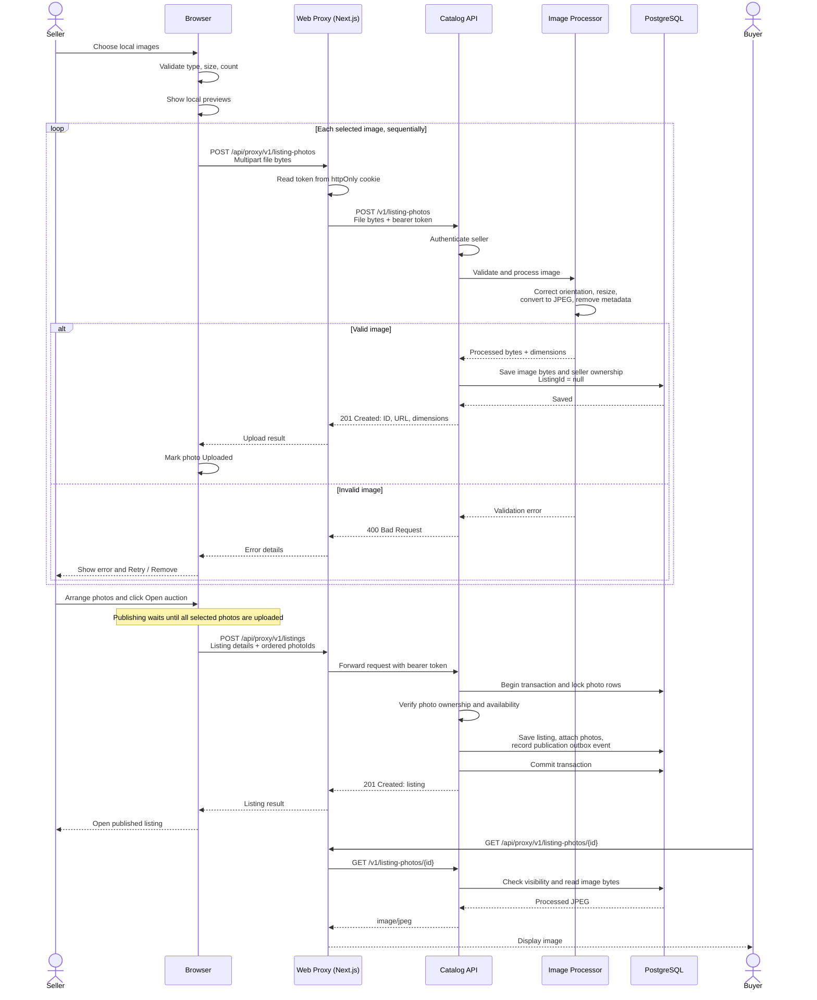

# Image upload sequence

This diagram describes local image selection, upload, publication and retrieval in the current implementation.

```mermaid
sequenceDiagram
    actor Seller
    participant Browser
    participant Web as Web Proxy (Next.js)
    participant API as Catalog API
    participant Processor as Image Processor
    participant DB as PostgreSQL
    actor Buyer

    Seller->>Browser: Choose local images
    Browser->>Browser: Validate type, size, count
    Browser->>Browser: Show local previews

    loop Each selected image, sequentially
        Browser->>Web: POST /api/proxy/v1/listing-photos<br/>Multipart file bytes
        Web->>Web: Read token from httpOnly cookie
        Web->>API: POST /v1/listing-photos<br/>File bytes + bearer token
        API->>API: Authenticate seller
        API->>Processor: Validate and process image
        Processor->>Processor: Correct orientation, resize,<br/>convert to JPEG, remove metadata

        alt Valid image
            Processor-->>API: Processed bytes + dimensions
            API->>DB: Save image bytes and seller ownership<br/>ListingId = null
            DB-->>API: Saved
            API-->>Web: 201 Created: ID, URL, dimensions
            Web-->>Browser: Upload result
            Browser->>Browser: Mark photo Uploaded
        else Invalid image
            Processor-->>API: Validation error
            API-->>Web: 400 Bad Request
            Web-->>Browser: Error details
            Browser-->>Seller: Show error and Retry / Remove
        end
    end

    Seller->>Browser: Arrange photos and click Open auction
    Note over Browser: Publishing waits until all selected photos are uploaded

    Browser->>Web: POST /api/proxy/v1/listings<br/>Listing details + ordered photoIds
    Web->>API: Forward request with bearer token
    API->>DB: Begin transaction and lock photo rows
    API->>API: Verify photo ownership and availability
    API->>DB: Save listing, attach photos,<br/>record publication outbox event
    API->>DB: Commit transaction
    API-->>Web: 201 Created: listing
    Web-->>Browser: Listing result
    Browser-->>Seller: Open published listing

    Buyer->>Web: GET /api/proxy/v1/listing-photos/{id}
    Web->>API: GET /v1/listing-photos/{id}
    API->>DB: Check visibility and read image bytes
    DB-->>API: Processed JPEG
    API-->>Web: image/jpeg
    Web-->>Buyer: Display image
```
